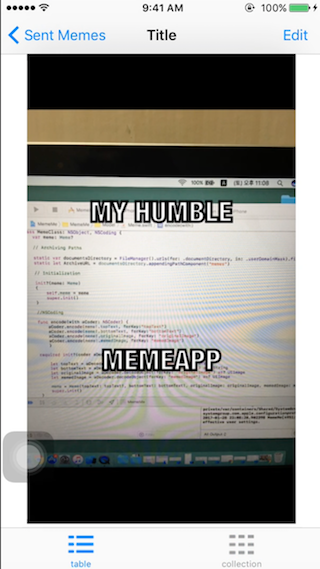

# memeMeApp_Sarah

>This is my second iOS Application Project from Boost Camp.

MemeMe is a meme-generating app that enables a user to attach a caption to a picture from their phone. 
After adding text to an image chosen from the Photo Album or Camera, the user can share with others.

## Contents

- **EditorController** - consists of an image view and two text fields. User pick photo from the camera or existing photo album.

- **TableController** and **CollectionController** - displays recently sent memes. User can delete selected image in Table View Controller.

- **DetailController** - displays the selected meme in an image view in the center of the page with the meme’s original image. User can edit the selected memed image as well.

---
## Screenshots
 
 

---
## Main Development Technique
* MVC/Singleton Pattern
* ImagePicker Controller
* Delegate Pattern for UITextFieldDelegate Protocol

--
## Demo video Youtube Link

<https://www.youtube.com/watch?v=56YzYAdKdek>
